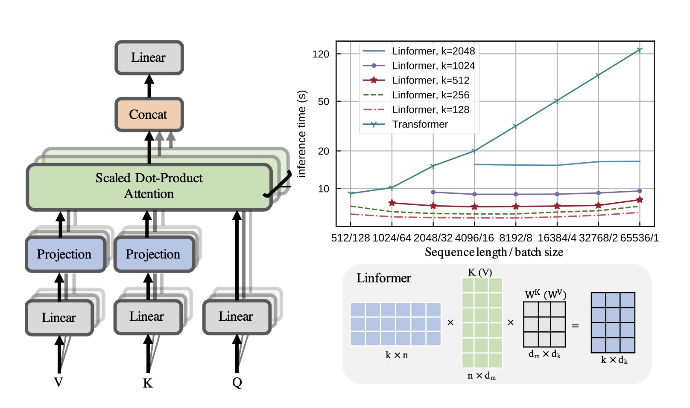

Linear Multihead Attention (Linformer)

PyTorch Implementation of reproducing the Linear Multihead Attention introduced in Linformer paper ([Linformer: Self-Attention with Linear Complexity](https://arxiv.org/abs/2006.04768)), which demonstrates that the self-attention mechanism can be approximated by a low-rank matrix and reduces the overall self-attention complexity from O(n^2) to O(n) in both time and space. 





# Implementation

This is an efficient implementation followed with the PyTorch official [`torch.nn.MultiheadAttention`](https://pytorch.org/docs/stable/nn.html?highlight=multiheadattention#torch.nn.MultiheadAttention) class and [`F.multi_head_attention_forward`](https://github.com/pytorch/pytorch/blob/71af538e31547e5b1bc814c9e00323a21905baf3/torch/nn/functional.py#L3854) function. 

Three additional argments defined in `LinearMultiheadAttention`: sequence length, the projected dimention `k` and the parameter sharing.

```
seq_len: the sequence length. Default: 100.
proj_k: the projected dimention `k` in Linformer paper. Default: 128.
param_sharing: parameter sharing mode: layerwise, none. headwise is not implemented. Default: none.
```


# Usage

Examples of using `torch.nn.MultiheadAttention`:
```
>>> import torch
>>> multihead_attn = torch.nn.MultiheadAttention(embed_dim, num_heads)
>>> attn_output, attn_output_weights = multihead_attn(query, key, value)
```

Examples of using `LinearMultiheadAttention`:
```
>>> from linear_multihead_attention import LinearMultiheadAttention
>>> multihead_attn = LinearMultiheadAttention(embed_dim, num_heads) 
>>> attn_output, attn_output_weights = multihead_attn(query, key, value)
```

Examples of using `LinearMultiheadAttention` with the sequence length of 512 and :
```
>>> from linear_multihead_attention import LinearMultiheadAttention
>>> multihead_attn = LinearMultiheadAttention(embed_dim, num_heads, seq_len=512, proj_k=256, param_sharing='layerwise') 
>>> attn_output, attn_output_weights = multihead_attn(query, key, value)
```

Linear-DETR: Replace `torch.nn.MultiheadAttention` in [DETR](https://github.com/facebookresearch/detr) with `LinearMultiheadAttention` in three lines in `models/transformer.py`, it saved much more memory and space, hope to have a comparable performance:

```
from linear_multihead_attention import LinearMultiheadAttention

# TransformerEncoderLayer
# self.self_attn = nn.MultiheadAttention(d_model, nhead, dropout=dropout)
self.self_attn = nn.MultiheadAttention(d_model, nhead, dropout=dropout, seq_len=w*h, proj_k=64) # where w, h are from `bs, c, h, w = src.shape`


# TransformerDecoderLayer
# self.self_attn = nn.MultiheadAttention(d_model, nhead, dropout=dropout)
# self.multihead_attn = nn.MultiheadAttention(d_model, nhead, dropout=dropout)

self.self_attn = LinearMultiheadAttention(d_model, nhead, dropout=dropout, seq_len=num_queries, proj_k=64) # where num_queries = args.num_queries
self.multihead_attn = LinearMultiheadAttention(d_model, nhead, dropout=dropout, seq_len=w*h, proj_k=64) # where w, h are from `bs, c, h, w = src.shape`

```


# Results on DETR

TODO

# Citation

```
@misc{wang2020linformer,
    title={Linformer: Self-Attention with Linear Complexity},
    author={Sinong Wang and Belinda Z. Li and Madian Khabsa and Han Fang and Hao Ma},
    year={2020},
    eprint={2006.04768},
    archivePrefix={arXiv},
    primaryClass={cs.LG}
}
```
